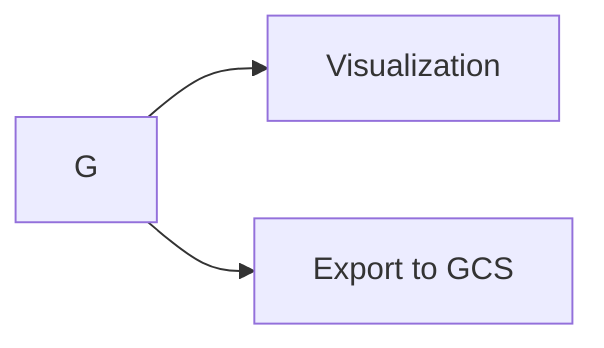
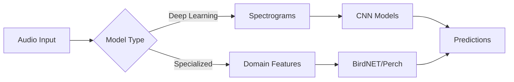

# ML Audio Classification

A containerized ML platform for audio classification experiments using multiple models (deep learning and specialized audio models) with automated cross-validation and GCS integration.

## Function

Runs comparative experiments on audio classification models to detect **coyote**, **bullfrog**, and **human_vocal** sounds. Supports training size experiments (0-300 samples), cross-validation, and generates ROC-AUC comparison visualizations across different models and datasets.

## Contents

```
ml-audio-classification/
├── src/ml_audio_classification/     # Main application code
│   ├── cli.py                       # Command-line interface
│   ├── config.py                    # Configuration management
│   ├── core/                        # Core utilities (logging, exceptions)
│   ├── data/                        # Data pipeline (GCS, audio processing)
│   ├── experiments/                 # Experiment orchestration
│   └── models/                      # Model implementations
├── k8s/                            # Kubernetes deployment files
├── scripts/                        # Setup and utility scripts
├── tests/                          # Unit tests
├── Dockerfile                      # Container definition
├── docker-compose.yml             # Local container orchestration
└── pyproject.toml                 # Python package configuration
```

## Setup Instructions

### 1. Container Setup

**Prerequisites:**
- Docker and Docker Compose
- Google Cloud Service Account with Storage permissions

**Quick Start:**
```bash
# Clone repository
git clone <your-repo-url>
cd ml-audio-classification

# Quick setup with interactive script
./scripts/setup-config.sh

# OR manual setup:
# Add GCP credentials
mkdir -p credentials
# Copy your service account JSON key to credentials/gcp-key.json

# Configure environment  
cp .env.example .env
# Edit .env and set:
#   GCP_PROJECT_ID=your-project-id
#   GCS_BUCKET_NAME=your-bucket-name

# Build and test
docker-compose build
docker-compose run --rm ml-audio-classification python -m ml_audio_classification --help
```

### 2. Development Setup (Optional)

```bash
# Install locally for development
pip install -e .

# Or use the setup script
./scripts/setup-dev.sh
```

### 3. GCP Credentials Setup

**For new users with different buckets:**

1. **Create Service Account:**
   In Google Cloud Console or via gcloud CLI
   ```bash
   gcloud iam service-accounts create ml-audio-classifier \
     --description="ML Audio Classification Service Account"
   
   gcloud projects add-iam-policy-binding YOUR_PROJECT_ID \
     --member="serviceAccount:ml-audio-classifier@YOUR_PROJECT_ID.iam.gserviceaccount.com" \
     --role="roles/storage.objectAdmin"
   
   gcloud iam service-accounts keys create credentials/gcp-key.json \
     --iam-account=ml-audio-classifier@YOUR_PROJECT_ID.iam.gserviceaccount.com
   ```

2. **Update Configuration:**
   Edit .env file
   ```bash
   GCP_PROJECT_ID=your-project-id
   GCS_BUCKET_NAME=your-bucket-name
   GOOGLE_APPLICATION_CREDENTIALS=/app/credentials/gcp-key.json
   ```

3. **Bucket Structure Required:**
   ```
   your-bucket/
   ├── soundhub/data/audio/
   │   ├── coyote/data/          # Positive samples
   │   ├── coyote/non_target/    # Negative samples
   │   ├── bullfrog/data/
   │   ├── bullfrog/non_target/
   │   ├── human_vocal/data/
   │   └── human_vocal/non_target/
   └── soundhub/results/         # Output location
   ```

## Running Experiments

### CLI Commands

**Single Experiment:**
Using Docker
```bash
docker-compose run --rm ml-audio-classification \
  python -m ml_audio_classification run-experiment \
  --models vgg mobilenet \
  --species coyote \
  --training-sizes 25 50 75 \
  --cv-folds 5
```
Local installation
```bash
python -m ml_audio_classification run-experiment \
  --models birdnet mobilenet \
  --species bullfrog \
  --training-sizes 25 50 75 \
  --cv-folds 5
```

**Grid Search (Multiple Models/Species):**
```bash
docker-compose run --rm ml-audio-classification \
  python -m ml_audio_classification grid-search \
  --models vgg mobilenet resnet birdnet perch \
  --species coyote bullfrog human_vocal \
  --training-sizes 25 50 75 100 \
  --max-concurrent 2
```

**Available Models:**
- `vgg`, `mobilenet`, `resnet` (deep learning with spectrograms)
- `birdnet`, `perch` (specialized audio models)

### Kubernetes Deployment

**Setup GKE Cluster:**
```bash
# Create cluster
./k8s/setup-gke.sh

# Configure secrets
./k8s/setup-secrets.sh

# Deploy application
./k8s/deploy-complete.sh
```

**Run Experiments on K8s:**
```bash
# Edit and deploy experiment job
kubectl apply -f k8s/03-experiment-job.yaml

# Monitor progress
kubectl logs -f job/ml-audio-experiment -n ml-audio-classification

# Get results
kubectl cp ml-audio-classification/pod-name:/app/results ./local-results
```

**Scale Experiments (preferred):**
```bash
# Launch multiple experiments
./k8s/launch-experiment.sh

# Monitor all jobs
kubectl get jobs -n ml-audio-classification
```

## Configuration

**Environment Variables:**
- `GCP_PROJECT_ID` - Google Cloud Project ID
- `GCS_BUCKET_NAME` - Storage bucket name
- `GOOGLE_APPLICATION_CREDENTIALS` - Path to service account JSON
- `LOG_LEVEL` - Logging level (INFO, DEBUG, WARNING)
- `TESTING_MODE` - Set to `true` for local testing without GCS

**Configuration Files:**
- `.env` - Environment variables
- `pyproject.toml` - Package dependencies and settings
- `docker-compose.yml` - Container orchestration
- `k8s/01-namespace-config.yaml` - Kubernetes configuration

Results are automatically saved to GCS (`your-bucket/soundhub/results/`) and locally (`./results/`) with timestamps and experiment metadata.


### Model Architecture



## Troubleshooting

### Common Issues

**GCS Authentication**
```bash
export GOOGLE_APPLICATION_CREDENTIALS=/path/to/credentials.json
gsutil ls gs://your-bucket-name
```

**Memory Issues**
```bash
export BATCH_SIZE=16
export MAX_WORKERS=2
```

**Kubernetes Issues**
```bash
kubectl describe pod -n ml-audio-classification
kubectl logs -n ml-audio-classification deployment/ml-audio-classification
```
