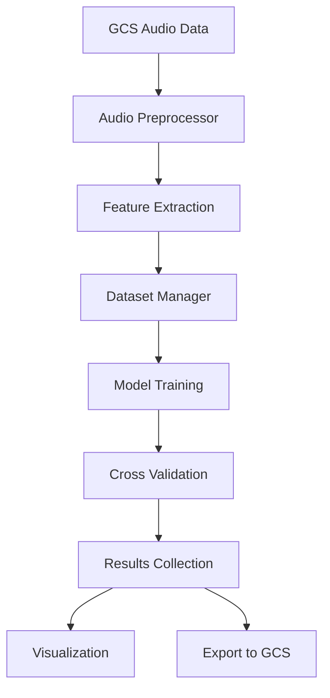
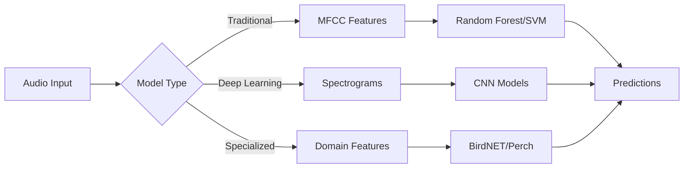

# ML Audio Classification Experiment Platform

A comprehensive Kubernetes-deployable platform for running machine learning experiments on audio classification tasks. The system supports multiple models (traditional ML and deep learning) with automated experiment orchestration, cross-validation, and results visualization.

## Project Goal

Build a Kubernetes-deployable application that runs multi-factor ML experiments on audio classification models, generating ROC-AUC comparison plots across different training data sizes and species, specifically targeting **coyote**, **bullfrog**, and **human_vocal** detection.

## Features

### 🎯 **Multi-Model Support**
- **Traditional ML**: Random Forest, SVM with MFCC features
- **Deep Learning**: VGG, MobileNet, ResNet with spectrograms  
- **Specialized**: BirdNET and Perch for audio classification
- **Unified Interface**: All models implement the same training/inference API

### 🔧 **Experiment Orchestration**
- **Multi-Factor Experiments**: Test combinations of models, species (coyote/bullfrog/human_vocal), and training sizes (0-300 samples)
- **Cross-Validation**: Automated k-fold CV with statistical validation
- **Async Processing**: Concurrent model training and data processing
- **Experiment Scheduling**: Queue and manage complex experiment workflows
- **Grid Search**: Comprehensive parameter space exploration

### 📊 **Data Pipeline**
- **Google Cloud Storage**: Async integration with `dse-staff/soundhub/data/audio/{species}/data` paths
- **Special Perch Support**: Uses `data_5s` subdirectory for 5-second audio segments
- **Audio Processing**: MFCC extraction, spectrogram generation, resampling
- **Balanced Sampling**: Equal pos/neg samples with automatic size limits based on available data
- **Results Output**: Writes to `dse-staff/soundhub/results/` bucket

### 📈 **Visualization & Results**
- **Per-Species ROC-AUC Charts**: x=sample size, y=ROC-AUC, lines=models, error bars=confidence intervals
- **Interactive Plots**: Training progression, model comparisons, heatmaps
- **Export Formats**: JSON, CSV, and cloud storage integration
- **Statistical Analysis**: Confidence intervals, cross-validation metrics

### ☁️ **Cloud-Native Deployment**
- **Kubernetes Ready**: Complete K8s manifests with ConfigMaps and Secrets
- **Docker Support**: Multi-stage builds with optimized images
- **Resource Management**: CPU/memory limits and scheduling
- **Monitoring**: Health checks, logging, and observability

## Quick Start

### 1. Docker Setup (Recommended)

The easiest way to run this application is using Docker, which provides a reproducible environment with all dependencies:

```bash
# Clone the repository
git clone <repository-url>
cd ml-audio-classification-v2

# Run the automated setup script
./scripts/setup-docker.sh

# Or manually set up:
# 1. Download your GCP service account key to credentials/gcp-key.json
# 2. Update .env file with your GCP_PROJECT_ID
# 3. Build and run with Docker Compose
docker-compose build
docker-compose run --rm ml-audio-classification python -m ml_audio_classification.cli --help
```

### 2. Local Installation (Alternative)

```bash
# Install dependencies
pip install -r requirements.txt

# Install the package
pip install -e .
```

## Docker Usage

### Prerequisites

1. **Docker & Docker Compose**: Install from [docker.com](https://docker.com)
2. **Google Cloud Credentials**: Service account JSON key with Cloud Storage access
3. **GCP Project**: Active Google Cloud Project with Cloud Storage API enabled

### Setup

1. **Run the setup script**:
   ```bash
   ./scripts/setup-docker.sh
   ```
   This script will:
   - Check Docker installation
   - Create necessary directories
   - Guide you through GCP credential setup
   - Build the Docker image
   - Run tests

2. **Manual Setup** (if needed):
   ```bash
   # Create directories
   mkdir -p credentials data results logs
   
   # Copy environment template
   cp .env.example .env
   
   # Download GCP service account key to credentials/gcp-key.json
   # Edit .env file with your GCP_PROJECT_ID
   
   # Build Docker image
   docker-compose build
   ```

### Running Experiments

```bash
# Run single experiment
docker-compose run --rm ml-audio-classification python -m ml_audio_classification.cli run-experiment \
  --models random_forest vgg \
  --species coyote \
  --training-sizes 100 500 1000

# Run comprehensive grid search
docker-compose run --rm ml-audio-classification python -m ml_audio_classification.cli grid-search \
  --models random_forest svm vgg mobilenet resnet birdnet perch \
  --species coyote bullfrog human_vocal \
  --training-sizes 100 500 1000 2000 \
  --max-concurrent 3

# Check configuration
docker-compose run --rm ml-audio-classification python -c "from ml_audio_classification.config import settings; print(f'Project: {settings.gcp.project_id}')"
```

### Docker Development

```bash
# Run interactive shell in container
docker-compose run --rm ml-audio-classification bash

# Run Jupyter notebook server
docker-compose run --rm -p 8888:8888 ml-audio-classification jupyter lab --ip=0.0.0.0 --allow-root

# View logs
docker-compose logs ml-audio-classification

# Clean up
docker-compose down
docker system prune -f
```

## Local Development

### 2. Configuration

```bash
# Copy configuration template
cp .env.example .env

# Edit configuration
export GCP_PROJECT_ID="your-project"
export GCS_BUCKET_NAME="your-bucket"
export GOOGLE_APPLICATION_CREDENTIALS="path/to/credentials.json"
```

### 3. Run a Simple Experiment

```bash
# Single experiment with specific models
python -m ml_audio_classification run-experiment \
  --models random_forest vgg \
  --species coyote \
  --training-sizes 100 500 1000 \
  --cv-folds 5 \
  --output-dir ./results
```

### 4. Comprehensive Grid Search

```bash
# Grid search across all models and multiple species
python -m ml_audio_classification grid-search \
  --models random_forest svm vgg mobilenet resnet birdnet perch \
  --species coyote bullfrog human_vocal \
  --training-sizes 100 500 1000 2000 \
  --cv-folds 5 \
  --max-concurrent 3 \
  --output-dir ./grid_search_results
```

## Architecture

### Project Structure

```
ml-audio-classification-v2/
├── src/ml_audio_classification/
│   ├── config.py                 # Pydantic configuration management
│   ├── core/                     # Core utilities
│   │   ├── exceptions.py         # Custom exception classes
│   │   └── logging.py            # Structured logging setup
│   ├── data/                     # Data pipeline
│   │   ├── gcs_client.py         # Google Cloud Storage integration
│   │   ├── audio_preprocessor.py # Audio feature extraction
│   │   └── dataset_manager.py    # Dataset creation and management
│   ├── models/                   # ML models
│   │   ├── base.py              # Abstract base classes
│   │   ├── traditional.py       # Random Forest, SVM
│   │   ├── deep_learning.py     # VGG, MobileNet, ResNet
│   │   ├── specialized.py       # BirdNET, Perch
│   │   └── factory.py           # Model factory pattern
│   ├── experiments/             # Experiment orchestration
│   │   ├── experiment_runner.py # Core experiment execution
│   │   ├── experiment_scheduler.py # Advanced scheduling
│   │   └── visualization.py     # Results visualization
│   ├── cli.py                   # Command-line interface
│   └── __main__.py              # Module entry point
├── k8s/                         # Kubernetes manifests
├── docker-compose.yml           # Docker Compose setup
├── Dockerfile                   # Container definition
└── requirements.txt             # Python dependencies
```

### Data Flow



### Model Architecture



## Configuration

### Environment Variables

```bash
# Google Cloud Platform - matching CLAUDE.md paths
GCP_PROJECT_ID=your-project-id
GCS_BUCKET_NAME=dse-staff
GOOGLE_APPLICATION_CREDENTIALS=/path/to/credentials.json

# Application Settings
LOG_LEVEL=INFO
MAX_WORKERS=4
AUDIO_SAMPLE_RATE=22050

# ML Settings
RANDOM_SEED=42
DEFAULT_CV_FOLDS=5
```

### Pydantic Configuration

The system uses Pydantic for type-safe configuration management:

```python
from ml_audio_classification.config import settings

# Access nested configuration
print(settings.gcp.project_id)
print(settings.experiment.cv_folds)
print(settings.audio.sample_rate)
```

## Docker Deployment

### Build and Run

```bash
# Build the image
docker build -t ml-audio-classification:latest .

# Run with Docker Compose
docker-compose up -d

# Run a specific experiment
docker-compose run ml-audio-classification \
  python -m ml_audio_classification run-experiment \
  --models random_forest vgg \
  --species "Turdus migratorius" \
  --training-sizes 100 500
```

### Environment Setup

```bash
# Copy environment template
cp .env.example .env

# Edit .env file with your configuration
vim .env
```

## Kubernetes Deployment

### Prerequisites

- Kubernetes cluster (GKE, EKS, AKS, or local)
- kubectl configured
- Docker registry access (for custom images)

### Deployment Steps

```bash
# 1. Build and push image (replace with your registry)
docker build -t gcr.io/your-project/ml-audio-classification:latest .
docker push gcr.io/your-project/ml-audio-classification:latest

# 2. Update image in k8s/02-deployment.yaml
# 3. Update secrets in k8s/01-namespace-config.yaml

# 4. Deploy to cluster
kubectl apply -f k8s/

# 5. Check deployment status
kubectl get pods -n ml-audio-classification

# 6. Run experiments using Jobs
kubectl apply -f k8s/03-jobs.yaml
```

### Monitoring Jobs

```bash
# Watch job progress
kubectl get jobs -n ml-audio-classification -w

# View job logs
kubectl logs -n ml-audio-classification job/ml-audio-classification-single-experiment

# Access results
kubectl exec -n ml-audio-classification -it deployment/ml-audio-classification -- ls /app/results
```

## Advanced Usage

### Custom Model Integration

```python
from ml_audio_classification.models.base import FeatureBasedModel
import numpy as np

class CustomModel(FeatureBasedModel):
    """Custom ML model implementation."""
    
    def __init__(self, **kwargs):
        super().__init__(**kwargs)
        self.model = None  # Your model here
    
    async def _train_model(self, X: np.ndarray, y: np.ndarray) -> None:
        """Train the custom model."""
        # Implement your training logic
        pass
    
    async def _predict(self, X: np.ndarray) -> np.ndarray:
        """Make predictions."""
        # Implement your prediction logic
        pass

# Register with factory
from ml_audio_classification.models.factory import ModelFactory
ModelFactory.register_model("custom", CustomModel)
```

### Programmatic API

```python
import asyncio
from ml_audio_classification.experiments import ExperimentRunner, ExperimentConfig

async def run_custom_experiment():
    runner = ExperimentRunner()
    
    config = ExperimentConfig(
        models=["random_forest", "vgg"],
        species=["Turdus migratorius"],
        training_sizes=[100, 500, 1000],
        cv_folds=5
    )
    
    results = await runner.run_multi_factor_experiment(config)
    
    for result in results:
        print(f"Species: {result.species}")
        print(f"Training Size: {result.training_size}")
        for model_name, model_result in result.model_results.items():
            print(f"  {model_name}: ROC-AUC = {model_result.roc_auc:.3f}")

# Run the experiment
asyncio.run(run_custom_experiment())
```

### Experiment Scheduling

```python
import asyncio
from datetime import datetime, timedelta
from ml_audio_classification.experiments import ExperimentScheduler, ExperimentConfig

async def schedule_experiments():
    scheduler = ExperimentScheduler()
    
    # Schedule immediate experiment
    config1 = ExperimentConfig(
        models=["random_forest"],
        species=["Turdus migratorius"],
        training_sizes=[100, 500]
    )
    scheduler.schedule_experiment("exp_1", config1)
    
    # Schedule delayed experiment
    config2 = ExperimentConfig(
        models=["vgg"],
        species=["Corvus brachyrhynchos"],
        training_sizes=[100, 500]
    )
    scheduler.schedule_experiment(
        "exp_2", 
        config2, 
        scheduled_time=datetime.now() + timedelta(hours=2)
    )
    
    # Start scheduler
    await scheduler.start_scheduler(max_concurrent=2)

asyncio.run(schedule_experiments())
```

## Model Details

### Traditional ML Models

#### Random Forest
- **Features**: 13 MFCC coefficients + derivatives
- **Hyperparameters**: 100 trees, max depth auto-tuned
- **Best For**: Fast training, interpretable results

#### SVM
- **Features**: 13 MFCC coefficients + derivatives  
- **Kernel**: RBF with automatic gamma scaling
- **Best For**: Small datasets, good generalization

### Deep Learning Models

#### VGG-like CNN
- **Input**: Mel-spectrograms (128x128)
- **Architecture**: 4 conv blocks + 2 FC layers
- **Features**: Batch normalization, dropout
- **Best For**: High accuracy, sufficient data

#### MobileNet
- **Input**: Mel-spectrograms (224x224)
- **Architecture**: Depthwise separable convolutions
- **Features**: Lightweight, mobile-friendly
- **Best For**: Resource-constrained environments

#### ResNet
- **Input**: Mel-spectrograms (224x224)
- **Architecture**: Residual connections
- **Features**: Skip connections, deep networks
- **Best For**: Complex patterns, large datasets

### Specialized Models

#### BirdNET
- **Source**: [BirdNET-Analyzer](https://github.com/kahst/BirdNET-Analyzer)
- **Features**: Pre-trained bird call embeddings
- **Pipeline**: Audio → Embeddings → Shallow classifier
- **Best For**: Bird species identification

#### Perch
- **Source**: [Perch Models](https://github.com/google-research/perch)  
- **Features**: 5-second audio segments
- **Pipeline**: Audio → Perch embeddings → Classifier
- **Best For**: Bioacoustic research applications

## Performance Benchmarks

### Model Comparison (Sample Results)

| Model | ROC-AUC | Training Time | Memory Usage |
|-------|---------|---------------|--------------|
| Random Forest | 0.85 | 30s | 500MB |
| SVM | 0.82 | 2m | 300MB |
| VGG | 0.91 | 15m | 2GB |
| MobileNet | 0.89 | 10m | 1GB |
| ResNet | 0.93 | 25m | 3GB |
| BirdNET | 0.96 | 5m | 1.5GB |
| Perch | 0.94 | 8m | 2GB |

*Results on Coyote dataset with 1000 training samples*

## Troubleshooting

### Common Issues

#### 1. Import Errors
```bash
# Missing dependencies
pip install -r requirements.txt

# Optional visualization dependencies
pip install matplotlib seaborn pandas
```

#### 2. GCS Authentication
```bash
# Set credentials
export GOOGLE_APPLICATION_CREDENTIALS=/path/to/credentials.json

# Test access
gsutil ls gs://your-bucket-name
```

#### 3. Memory Issues
```bash
# Reduce batch size in config
export BATCH_SIZE=16

# Reduce max workers
export MAX_WORKERS=2
```

#### 4. Kubernetes Issues
```bash
# Check pod status
kubectl describe pod -n ml-audio-classification

# View logs
kubectl logs -n ml-audio-classification deployment/ml-audio-classification

# Check resource usage
kubectl top pods -n ml-audio-classification
```

### Performance Optimization

#### CPU Optimization
- Reduce `MAX_WORKERS` for CPU-bound tasks
- Use feature caching for repeated experiments
- Enable model parallelization where available

#### Memory Optimization  
- Process data in smaller batches
- Use streaming for large datasets
- Clear model caches between experiments

#### Storage Optimization
- Use compressed audio formats
- Implement progressive downloading
- Cache frequently used features

## Contributing

### Development Setup

```bash
# Clone repository
git clone <repository-url>
cd ml-audio-classification-v2

# Create virtual environment
python -m venv venv
source venv/bin/activate

# Install development dependencies
pip install -r requirements-dev.txt
pip install -e .

# Run tests
pytest

# Run linting
black src/
flake8 src/
mypy src/
```

### Code Standards

- **Type Hints**: All functions must have type annotations
- **Documentation**: Docstrings for all public APIs
- **Testing**: Unit tests for core functionality
- **Async**: Use async/await for I/O operations
- **Logging**: Structured logging with context

### Adding New Models

1. Inherit from `FeatureBasedModel` or `DeepLearningModel`
2. Implement required abstract methods
3. Register with `ModelFactory`
4. Add tests and documentation
5. Update configuration schema

## License

[Add your license information here]

## Citation

If you use this system in research, please cite:

```bibtex
@software{ml_audio_classification,
  title={ML Audio Classification Experiment Platform},
  author={[Your Name]},
  year={2024},
  url={[Repository URL]}
}
```

## Support

- **Issues**: [GitHub Issues](repository-url/issues)
- **Documentation**: [Project Wiki](repository-url/wiki)
- **Discussions**: [GitHub Discussions](repository-url/discussions)

---

**Built with ❤️ for the machine learning and bioacoustics research community**